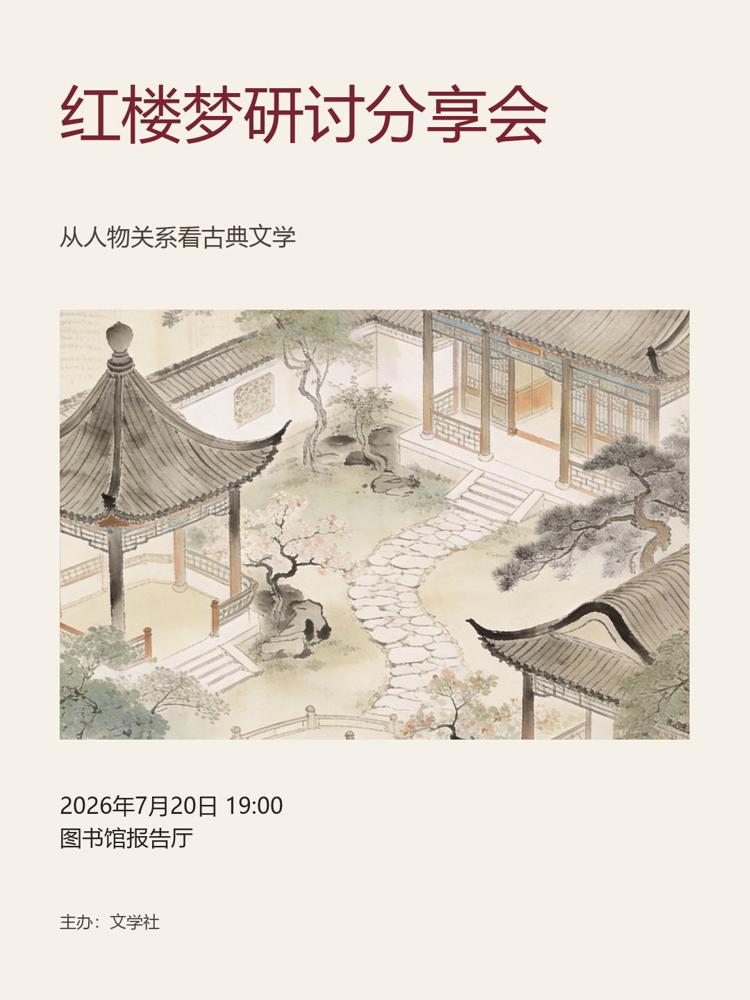
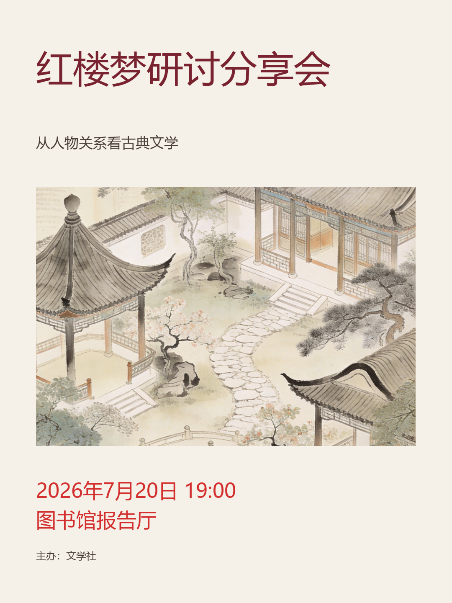

# PosterPilot

可控的海报生成与评测优化 Agent。基于 **React + FastAPI + LangGraph**，将设计知识检索、主视觉生成、中文排版、多信号评测和人工反馈连接起来。

用户填写活动信息后，系统生成并评测初版海报；用户可以结束任务，也可以提出修改目标。Agent 根据反馈选择工具，完成一轮调整和复评，再暂停等待用户决定。

## 核心能力

- **受约束 ReAct**：LLM 选择检索、文字、布局和背景调整工具，读取 Observation 后继续决策；工具白名单、参数 Schema 和调用预算限制执行范围。
- **原生 HITL**：使用 LangGraph `interrupt`、`Command(resume=...)` 和 SQLite Checkpointer，在同一任务状态中暂停与恢复。
- **RAG 知识增强**：LangChain 组件、Ollama Embeddings 和 Chroma 支持过滤、向量召回、词法混合排序及来源引用。
- **生成与排版分离**：图像模型生成无文字主视觉，Pillow 根据结构化设计确定性绘制中文，避免生图过程改变活动事实。
- **评测驱动优化**：结合版式规则、视觉模型和可选的 DeepGaze 注意力预测；提供注意力辅助布局候选、优化目标检查和轮次对比。
- **案例与字体选择**：有出处的海报案例 Wiki、设计特点选择和 6 款 OFL 中文标题字体。案例字体仅作风格近似，不是恢复原字体。
- **运行可追溯**：工作台展示事件、知识引用、工具轨迹、评测结果及每轮正式海报；SSE 展示事件，轮询同步业务状态。

### 能力边界

- 这是**固定生成工作流 + 单个受约束 ReAct 循环 + 人工决策**，不是多 Agent 系统。
- 代码约束优化轮上限和工具预算，用户决定是否在上限内继续。工具先修改结构参数，轮末统一渲染和完整复评。
- DeepGaze 预测视觉注意分布，不是真实眼动，也不是审美优劣或实际传播效果的证明。
- 支持可控文字和布局调整，不支持任意主视觉对象的精确局部编辑。
- `BackgroundTasks` 是进程内后台任务，不是生产级可靠队列。SSE 不承诺模型 token 级实时输出。

## 案例展示

### 真实运行案例：生成与一轮优化

| 初版 | 一轮优化后 |
|---|---|
|  |  |

[完整案例](docs/demo/golden-demo-red-mansion.md)保留检索失败后改写查询、工具调用和评测边界。案例前后可用评测信号不同，不能把综合分变化直接当成排版优化的净提升。

### AI 视觉迭代示意：《梦红楼》淡彩人物画版

米色绢纸底、细线人物与赭红淡彩，搭配纵向毛笔行书；以少量枝石和留白衬托主角。迭代重点：适度放大左下角活动信息，调整日期、时间的分行与间距。

> 两图由生图模型直接生成与定向编辑，**非 PosterPilot 运行结果**，不作为 Agent 优化或评测证据。书法字属于生成图像，不代表当前渲染器可复现；活动信息为虚构示例。

| 初版（淡彩人物画） | 迭代优化版（信息排版） |
|---|---|
|  |  |

[迭代说明、参考图来源边界与提示词](docs/demo/menghonglou-ink-iteration.md) · [此前的摄影社书法风格示意](docs/demo/assets/calligraphy-photography-concept.png)

## 代码结构

```text
posterpilot/
├─ apps/api/          FastAPI、业务服务、LangGraph、RAG、渲染与评测
├─ apps/web/          React + TypeScript 工作台及前端测试
├─ services/deepgaze/ 独立注意力预测服务
├─ data/knowledge/    设计规则卡、检索评测集和案例来源
├─ data/templates/    竖版海报布局模板
├─ data/fonts/        可再分发标题字体及各自许可
├─ infra/             Ollama、Chroma 的 Docker Compose 配置
├─ scripts/           启动、知识入库、校验与测试
└─ docs/              代码导航、请求链路与演示说明
```

主要阅读入口：

- 页面与请求：`apps/web/src/pages/WorkspacePage.tsx`、`apps/web/src/api/client.ts`
- 任务服务：`apps/api/app/api/routes/runs.py`、`apps/api/app/services/run_service.py`
- 编排与恢复：`apps/api/app/agent/graph.py`、`apps/api/app/agent/executor.py`
- 决策与执行：`apps/api/app/agent/nodes/react_decide.py`、`apps/api/app/agent/tools/react_tools.py`
- 知识检索与渲染：`apps/api/app/rag/`、`apps/api/app/poster/`

详见[文件职责与功能映射](docs/framework-and-feature-map.md)和[请求生命周期](docs/request-lifecycle.md)。

## 本地启动（Windows）

启动脚本面向 Windows PowerShell。需要 Python 3.12、Node.js 22.12+（或受 Vite 支持的较新版本）、npm 和 Docker。正文中文字体优先使用 Windows 系统字体；其他系统需自行配置合法中文字体，不能直接照搬 Windows 字体路径。

### 1. 安装依赖

```powershell
git clone https://github.com/969385278/Posterpilot.git posterpilot
cd posterpilot
py -3.12 -m venv .venv
.\.venv\Scripts\python.exe -m pip install -e "apps/api[dev]"
npm --prefix apps/web ci
Copy-Item .env.example .env
```

在本地 `.env` 填写 `DEEPSEEK_API_KEY`、`ARK_API_KEY`，并按账户可用模型调整模型名称。不要提交真实密钥。正式运行路径使用 DeepSeek 文本模型与 Ark 图像/视觉 Provider；配置示例中的实验性 Provider 项不意味着前端已支持切换。

### 2. 检索依赖与索引

```powershell
docker compose -f infra/docker-compose.yml up -d ollama chroma
docker compose -f infra/docker-compose.yml exec ollama ollama pull bge-m3
.\.venv\Scripts\python.exe scripts/validate_knowledge.py
.\.venv\Scripts\python.exe scripts/build_knowledge_index.py
```

公开版本保留经整理的设计规则卡和来源引用，**不包含未确认再分发授权的原始 PDF 及其提取全文**。`source_chunks.jsonl` 在公开版本中为空，不影响已有规则卡索引。接入自己的 PDF 前，需确认使用/发布权限，再补充本地来源清单。

### 3. 启动 API 与前端

在两个终端分别运行：

```powershell
npm run dev:api
npm run dev:web
```

- 工作台：`http://127.0.0.1:5173`
- API 文档：`http://127.0.0.1:8787/docs`

DeepGaze 不可用时，系统应明确标记该信号缺失，并保留其他评测结果，不能把缺失信号视为真实得分。

### 4. 可选 DeepGaze

```powershell
py -3.12 -m venv .venv-deepgaze
.\.venv-deepgaze\Scripts\python.exe -m pip install -e "services/deepgaze[dev]"
.\.venv-deepgaze\Scripts\python.exe -m pip install -r services/deepgaze/requirements-model.txt
npm run dev:deepgaze
```

模型依赖与 GPU/CUDA 版本有关，需按本机环境核对，权重不随仓库分发。详见 [DeepGaze 说明](docs/deepgaze-feasibility.md)。完成全部环境准备后，可用 `npm run dev` 启动完整开发环境。

## 测试与验证

```powershell
.\.venv\Scripts\python.exe -m pytest apps/api/tests -q
.\.venv\Scripts\python.exe -m ruff check apps/api scripts
npm --prefix apps/web test
npm --prefix apps/web run build
.\.venv\Scripts\python.exe scripts/evaluate_retrieval.py --offline
```

安装独立 DeepGaze 开发依赖后可运行 `npm run verify`。单元测试使用可替换依赖，不代表每次都会真实生图或 GPU 推理。发布检查结果与已知问题见 [发布检查](docs/publication-check.md)。

## 发布说明与许可

这是从原本地 GazePoster 项目整理的独立发布副本，品牌、包名和 `POSTERPILOT_` 前缀已统一。新安装使用新的默认数据库/知识集合，不携带旧任务数据、密钥或历史提交。旧 `.env` 不能不经检查直接复用。

仓库排除了简历、头像、原始设计 PDF、旧摄像头/表情代码、虚拟环境、模型缓存、日志、数据库和运行产物。示例海报是明确选取的演示资料。

第三方字体、案例和模型各有独立许可，见 [THIRD_PARTY_NOTICES.md](THIRD_PARTY_NOTICES.md)。本次公开代码及明确列出的演示资料，未擅自选择 MIT 等整仓开源许可；第三方许可不代表整个项目使用同一许可。
