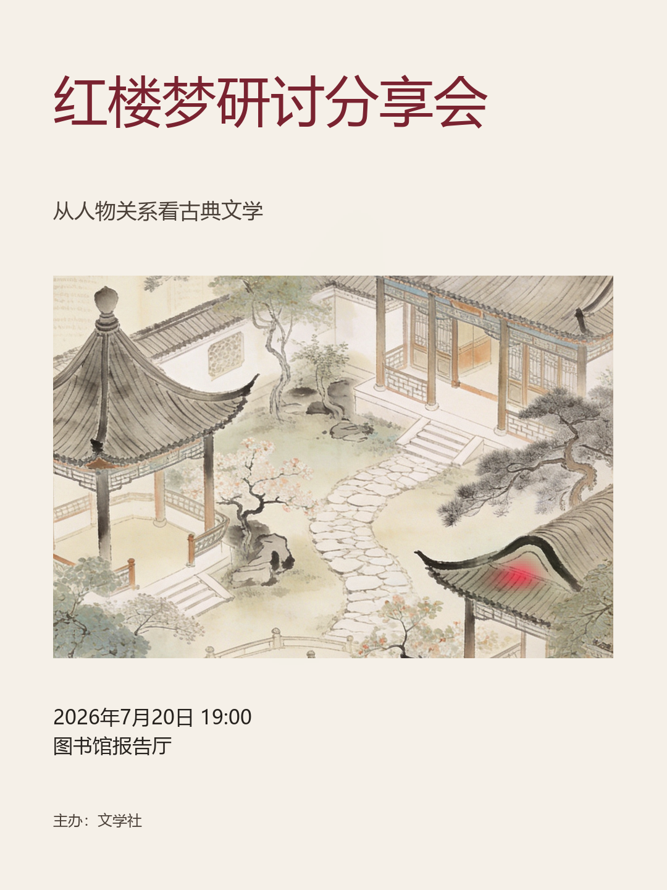
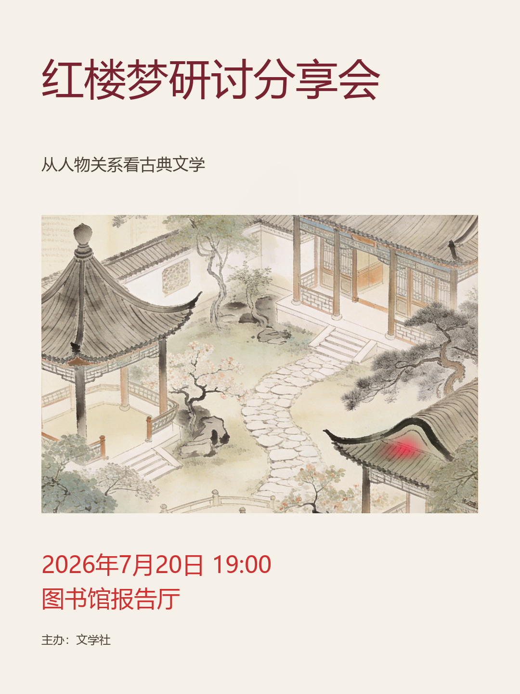

# PosterPilot 黄金演示案例：红楼梦研讨分享会

> 演示任务 ID：`514a6716-31fb-49a2-9c94-47b83a5e2fd3`  
> 画布：竖版 `1080 × 1440`  
> 结果：完成 1 轮 Human-in-the-loop ReAct 优化并由用户结束任务

## 1. 演示目标

该案例用于面试时展示完整 AI 应用闭环，而不是只展示一次海报生成：

```text
需求输入 → RAG → 设计规划 → 主视觉生成 → 程序化排版
→ 硬规则 + 视觉模型 + DeepGaze 评测 → 人工要求
→ ReAct 自主选工具 → 保存本轮版本 → 统一复评 → 人工结束
```

## 2. 输入需求

- 类型：文化活动
- 标题：红楼梦研讨分享会
- 副标题：从人物关系看古典文学
- 时间：2026 年 7 月 20 日 19:00
- 地点：图书馆报告厅
- 主办方：文学社
- 受众：大学生
- 风格：古典、克制、学术
- 视觉要求：大观园意象、书页纹理
- 禁止元素：现代霓虹、卡通人物

## 3. 人工干预

初版评测后，用户没有直接指定代码动作，而是输入自然语言要求：

> 时间和地点还不够醒目。请先检索相关海报设计知识，再增强 event_info 的字号、对比度和视觉层级；保持主视觉内容不变，完成一轮后停下来让我确认。

用户只决定目标与是否继续，具体工具和参数由 Agent 自主选择。

## 4. ReAct 工具轨迹

| 步骤 | Agent 决策与行动 | Observation |
|---|---|---|
| 1 | `search_design_knowledge`：检索“时间地点信息层级” | 相似度不足，没有可用卡片 |
| 2 | Agent 根据上一步结果改写查询为“时间地点醒目 字号对比度”，再次调用 `search_design_knowledge` | 召回 2 条可追溯规则 |
| 3 | `modify_typography`：把 `event_info` 字号改为 48，颜色改为 `#D32F2F` | 两个白名单动作安全执行成功 |

这段轨迹体现了 ReAct 的关键能力：第一次检索没有结果后，Agent 没有结束，而是根据 Observation 改写查询，再使用检索结果完成工具调用。

## 5. RAG 引用

第二次检索返回：

1. `text-contrast-wcag-001`：WCAG 文字与背景最低对比度规则。
2. `proximity-related-info-001`：Gestalt 邻近原则，用于组织时间、地点等相关信息。

引用来源随知识卡保留 `source_id` 和原文定位，不把模型自己的说法伪装成设计依据。

## 6. 优化结果

| 初版 | 第 1 轮优化版 |
|---|---|
|  |  |

变化集中在时间和地点信息：字号明显增大，颜色从深灰改为高对比红色。标题、主视觉、活动事实和主办方内容保持不变。

| 指标 | 初版 | 第 1 轮 |
|---|---:|---:|
| 综合分 | 61.54 | 72.20 |
| 可用评测权重 | 65/100 | 100/100 |
| 硬规则得分 | 40/40 | 40/40 |
| 视觉模型得分（加权） | 不可用 | 32.20/35 |
| DeepGaze 注意力得分 | 0/25 | 0/25 |

本轮分数变化为 `+10.66`。需要如实说明：初版视觉模型响应格式不可用，因此两个综合分的可用权重不同，不能把全部增幅都归因于排版优化。可确定的结果是硬规则保持满分、视觉模型认为优化版核心信息清晰，而 DeepGaze 的预测注意路径仍集中在主视觉，说明后续仍有优化空间。

## 7. DeepGaze 结果

| 初版注意力预测 | 第 1 轮注意力预测 |
|---|---|
|  |  |

DeepGaze 这里只表示模型预测的视觉注意力分布，不代表真实用户眼动，也不能据此宣称真实观众一定看向某个区域。

## 8. 面试讲解重点

- 为什么使用确定性模板：防止 LLM 随意修改活动事实、越界布局或输出不可渲染坐标。
- 为什么使用自定义 ReAct：能展示 Agent 的工具选择、Observation、自我纠正和有界执行，而不是一次性 Prompt。
- 为什么需要 Human-in-the-loop：用户控制优化目标、轮数和结束时机，Agent 负责执行细节。
- 为什么每轮只保存一个版本：工具级中间版本过于频繁，轮次级版本更适合比较和展示。
- 如何处理外部模型不稳定：严格 Schema、格式归一化、一次重试、可用权重和降级状态都显式保留。
