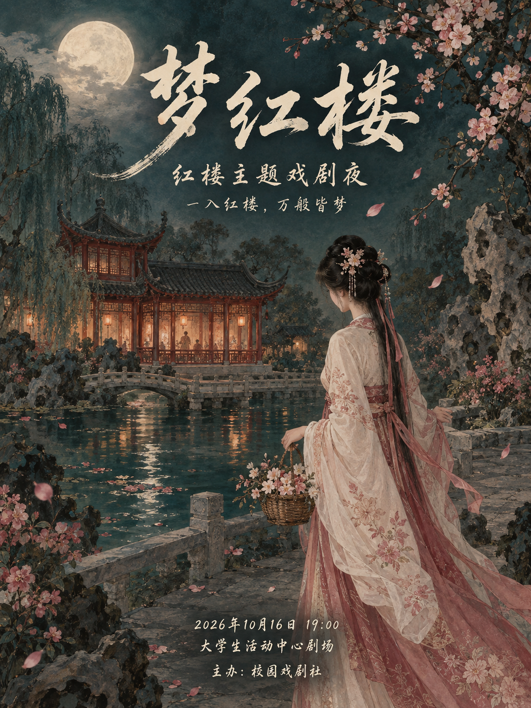
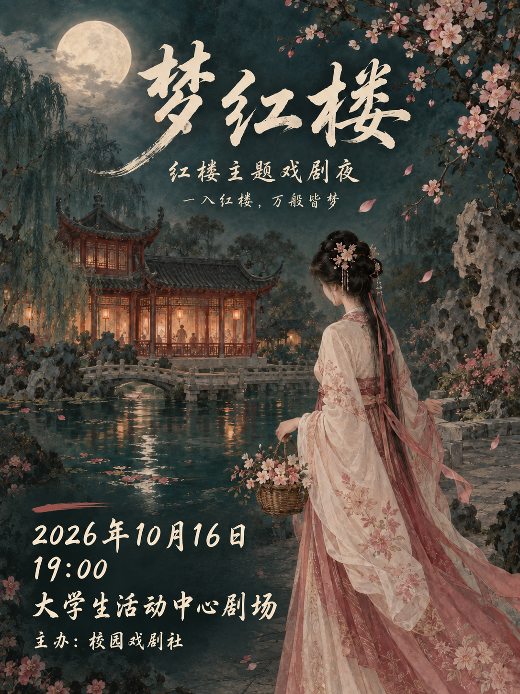

# 《梦红楼》AI 视觉迭代示意

## 来源与边界

本组两张图使用 Codex 内置 imagegen 生成：先生成初版，再把初版作为编辑输入，根据人工提出的修改要求生成迭代版。没有调用 PosterPilot 的 Agent、RAG、渲染器或评测服务，不是项目实际运行产物，也不作为自动优化能力或分数提升的证明。

书法字是生成图片中的像素内容，不是从图片提取出的字体文件。活动名称、主办方、时间和地点均为虚构展示信息；初版没有使用外部参考图。

## 展示图片

| 初版（AI 生成） | 迭代优化版（基于初版编辑） |
|---|---|
|  |  |

## 这次改了什么

初版采用居中信息排布。底部时间、地点偏小，部分文字与浅色裙摆背景相邻，缩略图中不易阅读。

迭代要求集中在活动信息区：将时间、地点移至左下方并左对齐；日期与时间分行；放大主要信息；用渐融的深青色底衬减弱局部背景干扰。上方书法标题、人物及园林主体尽量保留。生成式编辑仍可能改变画面细节，不承诺像素级一致。

这些是设计目标与人工目视观察，不是来自 DeepGaze、用户实验或自动评测的结论。

## 初版生成提示词

```text
Use case: ads-marketing.
Asset type: a finished flat portrait 3:4 Chinese cultural theatre event poster, full bleed, one image, no mockup.
Primary request: Create an elegant first visual concept for a fictional campus theatre night titled exactly "梦红楼" (these three characters in this order; do NOT change the title to 红楼梦). The event draws on the poetic garden world of Dream of the Red Chamber. Make a good, believable first proposal, not a deliberately bad example.
Scene and subject: a sophisticated hand-painted Chinese gongbi-meets-cinematic ink illustration. A young fictional classical Chinese woman in an ivory and muted rose hanfu, seen in three-quarter back view in the lower right, quietly holding a woven flower basket. Her delicate silhouette stands by a stone path over dark teal water. A vermilion pavilion with warm windows is in the middle distance. A pale round moon is veiled with soft ivory mist. A slender flowering branch enters from the upper right; a few rose petals float across the garden. No resemblance to any actor or existing film adaptation. Render the architecture and clothing with restrained, beautiful fine detail.
Style: poetic, quiet melancholy, tactile painted silk texture and mineral pigments, rich dark jade/teal shadows, muted cinnabar red, blush blossom accents, aged ivory light. The illustration fills the entire poster behind every word; no blank header/footer bars.
Typography: all text is authentic-looking handwritten Chinese brush lettering. Main title 梦红楼 in graceful flowing 行书 with lively tapering strokes and subtle 飞白, warm ivory color, centered horizontally in the upper quarter at a moderate size. Supporting copy is smaller handwritten 小楷/行楷, legible, elegant. Use a conventional centered first-draft hierarchy: title at top, event type and tagline immediately beneath; a modest centered information block near the bottom. Allow the illustrated moon, pavilion, flowers and title to share visual emphasis naturally.
Exact visible copy, each line once:
"梦红楼"
"红楼主题戏剧夜"
"一入红楼，万般皆梦"
"2026年10月16日 19:00"
"大学生活动中心剧场"
"主办：校园戏剧社"
Constraints: accurate readable Chinese; no Songti, Ming, Heiti, sans-serif, computer-font uniform strokes, bubble type, subtitles, seals, QR codes, logos, watermarks, additional English, rating scores, workflow UI or before/after labels. Full artwork without borders. One poster only.
```

## 迭代编辑提示词

编辑输入：`assets/menghonglou-concept-initial.png`。

```text
Use case: text-localization.
Input image 1 is the edit target: the initial 梦红楼 theatre poster. Produce one refined iteration of the SAME poster, in the same portrait dimensions. This is a typography and information-placement refinement, NOT a new illustration.
Keep unchanged: the hand-painted classical woman and her exact face, hair, pose, embroidered robe, flower basket; moon, flowering branches, vermilion pavilion, bridge, pond and garden perspective; the dark jade, cinnabar and ivory palette; full-bleed illustrated character. Retain the existing beautiful upper title 梦红楼 and the two lines under it with their same brush-calligraphy style. Do not move the subject or repaint the whole scene.
Specific improvement: the original bottom-centered event details are small and overlap the light robe. Remove ALL three old bottom-centered information lines cleanly. Recompose those event details as a visibly larger, legible LEFT-ALIGNED block in the lower-left corner, entirely to the left of the woman's robe. Start about 6 percent from the left edge and leave a 6 percent bottom margin. Fit the block in the lower-left roughly 42 percent of the canvas width. Quiet the distracting path/petals directly behind this information with a soft deep-jade ink-wash vignette that blends organically into the original scene, with no rectangle, border, hard panel or opaque footer band. Keep the rest of the scene unchanged.
Render the date and time as two separate lines for larger lettering, followed by the venue and a smaller organizer line. Graceful ivory handwritten 行楷 with visible brush variation, not Songti or Heiti. Prioritize clear and accurate reading. Make the date and venue about 35 percent larger than in the original, while preserving enough line spacing and staying off the woman's silhouette. A short muted-cinnabar brush line above the information block may subtly anchor it.
Exact text across the complete poster, each once:
"梦红楼"
"红楼主题戏剧夜"
"一入红楼，万般皆梦"
"2026年10月16日"
"19:00"
"大学生活动中心剧场"
"主办：校园戏剧社"
Do not change any event facts. No extra copy, labels, frame, watermark, logo, QR code, before/after marker, numeric score or UI. The result must clearly feel like an edited version of the supplied image rather than an unrelated second poster.
```
