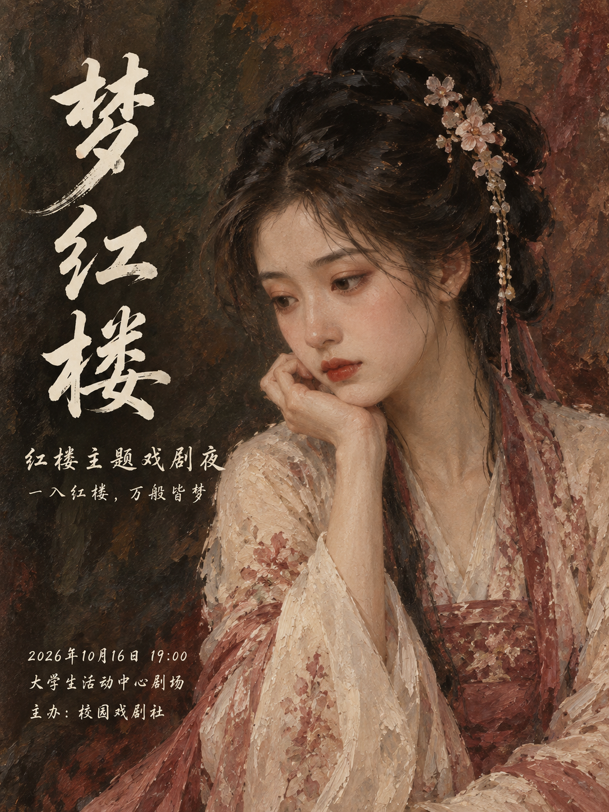
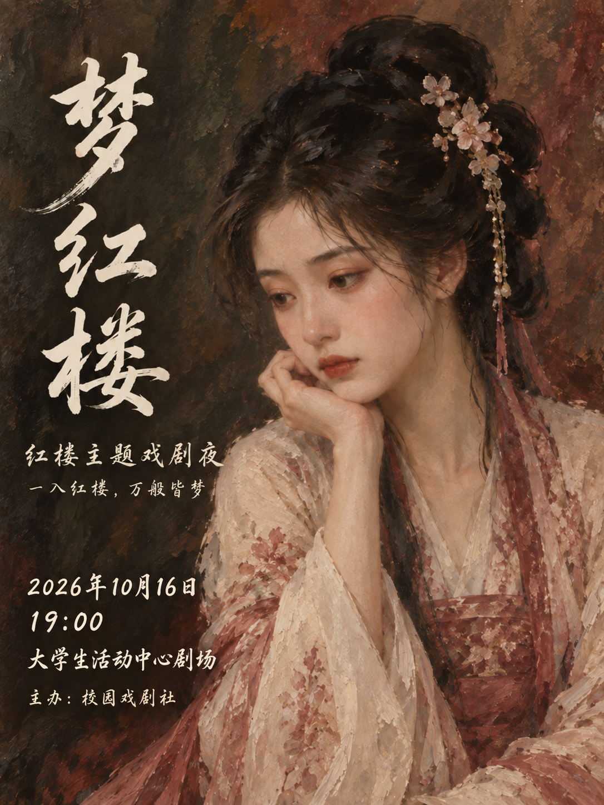

# 《梦红楼》人物油画版：AI 视觉迭代

## 本轮设计方向

以大幅人物半身近景为主体，用深棕、暗红及橄榄色的抽象油画背景替代园林景色，突出脸部神情、手部姿态和服饰笔触。保留纵向毛笔行书标题，不添加亭台、月亮、花树等景物。

## 图片与来源

| 油画初版 | 信息排版迭代版 |
|---|---|
|  |  |

两图使用 Codex 内置 imagegen 制作。来源链为：

1. 以[此前 AI 生成的园林初版](assets/menghonglou-concept-initial.png)为输入，按用户要求重构为人物油画版。
2. 再以油画初版为输入，适度放大左下角活动信息、将日期时间分行并调整间距。

本轮未新增第三方参考图。此前版本的生成过程见[旧版说明](menghonglou-concept-iteration.md)。

两张油画图均非 PosterPilot 工作流产物；未调用项目的 Agent、RAG、渲染器或评测服务。这里的“迭代”是根据人工指定要求进行图像编辑，不是自动优化效果证明。活动信息为虚构示例，书法字和油画笔触都是图像像素，不是新增字体文件。

## 人工检查

人物已由园林中的远景人物改为占据画面主要空间的近景；背景没有可识别的建筑或景色。迭代版保留相同人物构图，左下角日期、时间和地点更易辨认。以上是目视描述，没有量化评测；生成式编辑不保证细节或像素完全一致。

## 油画初版编辑提示词

输入：`assets/menghonglou-concept-initial.png`。

```text
Use case: style-transfer.
Input image 1 is the edit target: the previous 梦红楼 poster. Redesign it to match the user's new direction: MUCH less scenery, an unmistakable oil painting, and a dominant close portrait. Output one flat finished 3:4 portrait poster, not a mockup.
Keep the title exactly 梦红楼 and preserve all event facts, the fictional classical Chinese woman, her black updo and ivory/dusty-rose hanfu, and the reflective literary mood. Recompose freely as needed for this specific requested change.
CRITICAL SUBJECT AND COMPOSITION: replace the distant/back-view figure with an intimate, large waist-up three-quarter FRONT portrait of the same fictional character concept. Her face must be fully visible, delicately lit, pensive and quietly expressive, eyes lowered slightly left; natural anatomy, not a celebrity. Her head and upper body dominate around two-thirds of the entire canvas. Crop at the waist near the bottom edge, with the upper body extending from the center to the right edge. Her face is the strongest visual focus; no miniature person, no long full-body dress, no back-of-head portrait.
CRITICAL MEDIUM: authentic painterly oil-on-linen, visible confident brush strokes, broken-color edges, restrained impasto highlights, richly painted warm flesh tones, deep brown-black hair, expressive broad strokes in fabric. NOT a photograph, NOT a smooth digital beauty render, NOT gongbi fine linework, NOT watercolor, NOT anime. Keep the eyes and mouth finely observed, with looser shoulders and surroundings.
BACKGROUND: remove ALL gardens, pavilions, bridges, ponds, moon, tree branches, landscape, baskets and flying petals. Background is only subdued abstract oil-painted color fields: dark olive-charcoal and warm burgundy/umber, softly blending. No decorative motifs or extra props. Enough calm dark paint around the left side to support lettering.
Typography: ivory handwritten Chinese brush calligraphy, expressive running script 行书, irregular thick-thin strokes with 飞白. Main title 梦红楼 is stacked vertically down the left side in three large characters, elegant and substantial but not overpowering the face. Supporting event type and tagline are small, elegant horizontal handwritten 行楷 beneath the title; initial modest event information block near bottom left, with generous margins and no facial overlap. No Songti, Heiti, sans-serif or typed uniform strokes.
Exact visible text, each once:
"梦红楼"
"红楼主题戏剧夜"
"一入红楼，万般皆梦"
"2026年10月16日 19:00"
"大学生活动中心剧场"
"主办：校园戏剧社"
No added text, logo, watermark, QR, frame, decorative seals, score or comparison label. One quiet, emotionally compelling oil-painted character poster; portrait first, typography second, scenery absent.
```

## 排版迭代提示词

输入：`assets/menghonglou-oil-initial.png`。

```text
Use case: text-localization.
Input image 1 is the edit target: the new oil-painted 梦红楼 portrait poster. Make a subtle second iteration focusing ONLY on event information readability. Output the same portrait aspect ratio, one flat finished poster.
LOCK THE PORTRAIT: retain exactly the existing large close-up Chinese woman's face, expression, hand supporting cheek, hair, accessories, pose, ivory/rose clothing, skin tones and every major silhouette. Keep the oil painting brushwork, dark burgundy/umber/olive abstract background, and the three-character vertical ivory calligraphic 梦红楼 title unchanged. Keep the two supporting title lines. Do not reintroduce ANY garden, architecture, moon, foliage, petals or extra objects. The person must stay much more important than the text.
ONLY CHANGE THE LOWER-LEFT SCHEDULE BLOCK: the original date, venue and organizer are small and widely separated from the supporting title. Erase those old three lines. Move the schedule block slightly upward into the lower-left dark paint region and enlarge the date and venue modestly, about 20 percent rather than dramatically. Keep it strictly inside the dark area to the left of the sleeve, with safe left and bottom margins. Split the date and time into two lines to fit. Use larger readable ivory handwritten 行楷, not typed sans-serif or Songti. Organizer is smaller than date and venue, with generous line spacing. Darken and quiet only the tiny paint region behind this text very subtly if needed, no rectangular card, opaque footer, border or separator decoration. Do not cover the dress. Keep all upper text as it is.
Exact complete visible wording, once each:
"梦红楼"
"红楼主题戏剧夜"
"一入红楼，万般皆梦"
"2026年10月16日"
"19:00"
"大学生活动中心剧场"
"主办：校园戏剧社"
No extra characters, words, logos, watermarks, QR codes, seals, numeric scores, labels or before/after markers. This is a restrained typographic refinement of the same oil portrait, not a new illustration.
```
