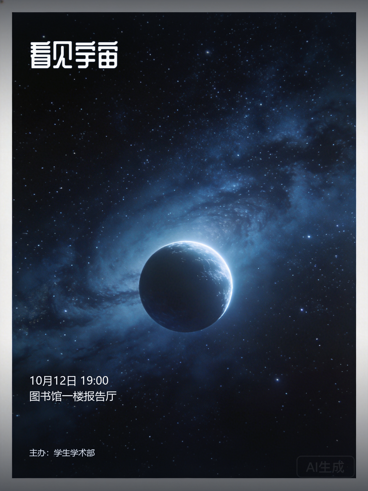
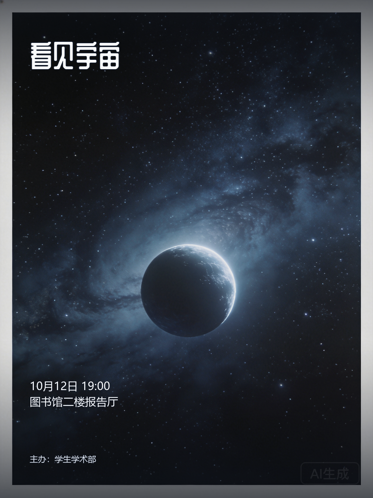

# 校园讲座「看见宇宙」运行案例

本例来自虚构用户故事的真实 API 集成测试。角色为学生学术部负责人，活动信息是测试输入，不是真实用户运营数据。初版及修改后图片直接复制自运行产物，没有额外修图。

## 初始需求

> 请制作讲座海报，标题：看见宇宙，时间：10月12日 19:00，地点：图书馆一楼报告厅，主办方：学生学术部。蓝色科技风，文字清楚。

## 两轮定向修改

|阶段|用户要求|核验内容|
|---|---|---|
|初版|生成蓝色科技风讲座海报|标题、时间、地点和主办方进入海报|
|第1轮|降低背景饱和度，标题的位置和字号不变|调整背景饱和度，保护标题位置和字号|
|第2轮|请把活动地点改为图书馆二楼报告厅，其他活动信息不变|地点由一楼变为二楼，保留时间及其他活动信息|

| 初版 | 第2轮结束 |
|---|---|
|  |  |

修改后的图片中，地点实际显示为“图书馆二楼报告厅”，时间仍为“10月12日 19:00”。运行报告记录最终目标达成、结束后问答正常且未修改任务。图中保留原始“AI生成”标记。

## 工程观察

- 连续修改分别处理背景目标和地点事实，避免前一轮一次性目标在后一轮重复执行。
- 地点属于结构化活动事实，修改后由程序排版，保留未指定的其他字段。
- 自然语言需求经解析与确认后进入执行；本测试通过 API 模拟确认，不代表真人完整浏览器使用实验。
- 本例说明这些指定请求在该次运行中得到处理，不据此宣称任意需求均成功，也不将两张图片作为审美提升的定量证明。

## 产物来源

本地原始记录目录：`work/interview-evaluation/user-stories-906d491f84a74b249b9872d4cdec563a/student-lecture/`。

`result.json` 保存故事及请求结果，`trace.json` 保存 API 过程，`checkpoint-0/1/2.json` 保存轮次状态；公开展示图来自 `run-artifacts/poster_initial.png` 和 `poster_round_2.png`。原始日志未随仓库发布。

公开图片的文件映射和 SHA256 见 [产物清单](student-lecture-assets.json)。
