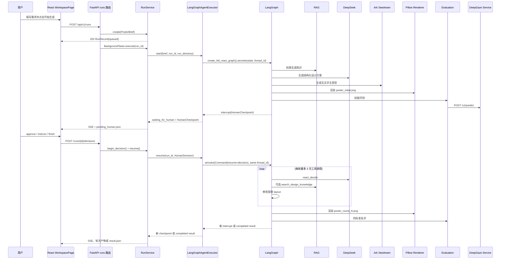

# PosterPilot 一次海报请求的真实调用链

> 目的：帮助项目作者从真实代码理解“点击开始生成”到“人工优化并展示结果”的完整过程。
>
> 审计范围：`apps/web`、`apps/api`、`services/deepgaze`、`data/templates` 以及已有运行产物。
>
> 结论只基于当前代码。README 或设计文档中存在、但运行时未使用的路径会明确标记。

## 1. 先看结论

当前生产运行路径确实形成了以下闭环：

```text
React 表单
-> POST /api/v1/runs
-> FastAPI BackgroundTasks
-> RunService
-> 同一个持久化 LangGraph thread
-> RAG
-> DeepSeek DesignSpec
-> Ark/Seedream 主视觉
-> Pillow 程序化排版
-> 硬规则 + Ark Vision + DeepGaze 评测
-> human_review 节点调用 interrupt() 暂停
-> 用户 approve / instruct / finish
-> Command(resume=decision) 恢复同一 thread
-> 最多 3 次工具调用
-> 每轮只渲染一次海报并复评
-> 最多 3 轮
-> result.json
-> React 展示轮次、评分、热力图、引用和工具轨迹
```

但需要准确理解四个边界：

1. **HITL 已使用 LangGraph 原生 interrupt。** `human_review()` 调用 `interrupt()`，用户决策通过 `Command(resume=...)` 恢复同一个 `thread_id=run_id`。
2. **Agent State 已持久化到独立 SQLite checkpointer。** 默认文件是 `data/langgraph-checkpoints.sqlite3`；API 重启并重新创建 Executor 后，可以从同一暂停点继续执行。
3. **DeepGaze 是模型预测，不是真实眼动。** 当前代码从预测热图中做局部极大值采样，得到一个启发式注视点序列，再映射到 AOI；它不是用户眼动数据，也不是完整的逐步自回归扫描路径实验。
4. **当前 ReAct 主要能修改文字和非主视觉布局。** `modify_visual` 虽出现在类型和注册表中，但提示词禁止调用，且动作校验不允许移动或缩放 full-bleed 主视觉，因此该工具在当前运行路径中实际不可用。

## 2. 总体时序



## 3. 前端：从点击按钮到 HTTP 请求

### 3.1 页面入口

| 项目 | 真实代码 |
|---|---|
| 文件 | `apps/web/src/app/App.tsx` |
| 组件 | `App()` |
| 输入 | 用户点击首页“创建海报” |
| 输出 | 本地状态 `page` 从 `home` 变为 `workspace`，渲染 `WorkspacePage` |
| 调用下游 | `WorkspacePage` |

这里没有 React Router，页面切换只是 `App` 内的组件状态。

### 3.2 表单数据

| 项目 | 真实代码 |
|---|---|
| 文件 | `apps/web/src/features/brief/BriefForm.tsx` |
| 组件/函数 | `BriefForm()`、内部 `submit()` |
| 输入 | `PosterBriefInput` 表单状态 |
| 输出 | 调用父组件传入的 `onSubmit(brief)` |
| 谁调用它 | `WorkspacePage` 渲染 `<BriefForm onSubmit={submit} />` |

`BriefForm` 的 HTML `required` 只约束主题、标题、时间、地点、主办方和目标受众。数组字段虽然存在于类型中，但当前页面没有输入控件，通常来自 `blankBrief` 的空数组或“填入演示样例”。

### 3.3 创建任务

| 项目 | 真实代码 |
|---|---|
| 文件 | `apps/web/src/pages/WorkspacePage.tsx` |
| 函数 | `submit(brief)` |
| 输入 | `PosterBriefInput` |
| 状态变化 | 清空旧事件、checkpoint、result 和错误；设置 `isSubmitting=true` |
| 调用下游 | `apps/web/src/api/client.ts` 的 `createRun(brief)` |
| 输出 | 把返回的 `RunRecord` 保存到 React 状态 `run` |

`createRun()` 实际发送：

```http
POST /api/v1/runs
Content-Type: application/json

<PosterBriefInput JSON>
```

前端只判断 `response.ok`。后端返回的 422 字段错误、409 业务错误或详细错误体目前不会展示，用户只会看到统一文案。

### 3.4 状态轮询与 SSE

`WorkspacePage` 的 `useEffect([run])` 同时使用两条更新通道：

- `subscribeRunEvents(run.id)` 创建 `EventSource('/api/v1/runs/{id}/events')`，接收 Agent 事件。
- 当状态不是 `waiting_for_human`、`completed` 或 `failed` 时，每 1500 ms 调用 `getRun(run.id)` 轮询任务状态。

状态分支：

- `waiting_for_human`：调用 `getPendingHumanInput()` 读取 checkpoint。
- `completed`：调用 `getRunResult()`，实际读取注册产物 `result.json`。
- `failed`：停止轮询，展示 `RunRecord.error_message`。

SSE 出错回调目前是空函数，连接错误不会直接显示；轮询仍能承担任务状态更新。

## 4. FastAPI：请求校验、任务创建和后台执行

### 4.1 应用初始化

| 项目 | 真实代码 |
|---|---|
| 文件 | `apps/api/app/main.py` |
| 函数 | `create_app()` |
| 创建对象 | `RunRepository`、`ArtifactService`、`EventBus`、`LangGraphAgentExecutor` |
| 保存位置 | `app.state.run_service` |

`create_runtime_executor()` 位于 `apps/api/app/agent/runtime.py`。`app.main` 在模块导入时只创建 FastAPI 对象，以下外部运行时延迟到 FastAPI lifespan 启动阶段构造：

- Ollama Embedding；
- 远程 Chroma 客户端；
- `KnowledgeRetriever`；
- `DeepSeekProvider`；
- `ArkImageProvider`；
- `PosterRenderer`；
- `DeepGazeClient`；
- `ArkVisionProvider` + `VisionEvaluator`；
- `LangGraphAgentExecutor`，并传入默认 checkpoint 路径 `data/langgraph-checkpoints.sqlite3`。

`AsyncSqliteSaver` 本身由 Executor 在第一次 `start()` 或 `resume()` 时懒加载并执行 `setup()`，FastAPI lifespan 结束时通过 `RunService.aclose()` 关闭连接。

这样导入 `app.main` 和执行不依赖运行时的健康检查不会立即连接 Chroma。生产服务进入 lifespan 时仍会创建 Chroma 客户端；如果 Chroma 没启动，API 启动仍会失败，尚未进入 `KnowledgeRetriever` 的请求期 fallback 逻辑。

### 4.2 Pydantic 请求校验

| 项目 | 真实代码 |
|---|---|
| 文件 | `apps/api/app/schemas/brief.py` |
| 模型 | `PosterBrief`、`CanvasSize` |
| 输入 | 前端 JSON |
| 输出 | 已去除首尾空格并完成类型校验的 `PosterBrief` |
| 失败 | FastAPI 自动返回 422 |

重要约束：

- `poster_type` 只能是 `campus_lecture`、`cultural_event`、`club_recruitment`。
- 多个核心文本字段不能为空。
- `notes` 最长 2000 字符。
- 画布必须为竖版，默认 1080 × 1440。

**部分实现：** `PosterBrief.canvas` 会被校验，但后续 `TemplateLoader` 使用模板文件自带画布，因此自定义 canvas 当前不会控制最终尺寸。

### 4.3 路由与立即响应

| 项目 | 真实代码 |
|---|---|
| 文件 | `apps/api/app/api/routes/runs.py` |
| 函数 | `create_run()` |
| 输入 | `PosterBrief`、`BackgroundTasks` |
| 调用 | `RunService.create(brief)`，再注册 `RunService.execute(run_id)` |
| 输出 | HTTP 202 + `RunRecord(status='queued')` |

FastAPI `BackgroundTasks` 在响应后由同一个 API 进程执行。它不是独立任务队列，不支持跨进程调度、持久化重试或进程崩溃恢复。

### 4.4 创建任务时保存什么

`RunService.create()` 位于 `apps/api/app/services/run_service.py`：

1. `RunRepository.create()` 把任务写入 SQLite 表 `poster_runs`。
2. `ArtifactService.write_json()` 写入 `data/runs/{run_id}/brief.json`。
3. `RunRepository.add_artifact()` 把该产物登记回任务记录。
4. `_emit()` 同时追加 `events.jsonl` 并通过内存 `EventBus` 推送 `run_created`。

SQLite 模型位于 `apps/api/app/persistence/models.py` 的 `RunRow`，保存：状态、brief、当前节点、错误、产物清单和时间戳。

## 5. Runtime 与 Agent 初始状态

### 5.1 开始执行

`RunService.execute()`：

1. 把数据库状态改成 `running`，`current_node='agent'`。
2. 发送 `node_started` 事件。
3. 调用 `LangGraphAgentExecutor.start()`。
4. 捕获任何未处理异常，将任务改为 `failed`，错误码为 `agent_execution_failed`。

### 5.2 Agent State

| 项目 | 真实代码 |
|---|---|
| 文件 | `apps/api/app/agent/state.py` |
| 类型 | `PosterAgentState` |
| 初始化 | `initial_agent_state(brief)` |

核心状态变化：

```text
brief
-> retrieval_generation
-> design_spec + layout
-> main_visual_path
-> poster_initial_path
-> evaluation_initial
-> human_instruction
-> react_decision
-> tool_traces + updated layout
-> poster_optimized_path
-> evaluation_optimized
-> round_snapshots
-> result
```

此外还包含 `events`、`errors`、`round_number`、`tool_calls_in_round`、`knowledge_citations` 和 `pending_human`。

**关键持久化边界：** `LangGraphAgentExecutor` 使用 `run_id` 作为 LangGraph `thread_id`。生产运行时通过 `AsyncSqliteSaver` 把每个 thread 的完整 checkpoint 写入 `data/langgraph-checkpoints.sqlite3`；未传 `checkpoint_path` 的单元测试才使用 `InMemorySaver`。

## 6. 原生 HITL LangGraph

### 6.1 图结构

运行时调用 `apps/api/app/agent/graph.py` 的 `create_hitl_react_graph()`。初版阶段为固定顺序，随后在同一张图内进入人工暂停和 ReAct 循环：

```text
START
-> retrieve_generation_knowledge
-> plan_design
-> generate_visual
-> render_draft
-> evaluate_draft
-> human_review
   -> interrupt(HumanCheckpoint)
   -> Command(resume=HumanDecision)
   -> finish: finalize -> END
   -> approve/instruct: react_decide
      -> execute_react_tool -> react_decide
      -> render_round -> evaluate_round -> complete_round
         -> 第 1/2 轮: human_review
         -> 第 3 轮: finalize -> END
```

图使用 SQLite checkpointer 保存每个节点后的状态。`human_review` 节点位于 `apps/api/app/agent/nodes/human_review.py`，是唯一人工暂停点。

### 6.2 节点输入输出表

| 节点 | 文件与函数 | 主要输入 | 主要输出 | 调用下游 | 失败行为 |
|---|---|---|---|---|---|
| 检索生成知识 | `agent/nodes/retrieve_knowledge.py` `retrieve_generation_knowledge()` | `brief` | `retrieval_generation: RetrievalResult` | `KnowledgeRetriever.retrieve()` | 向量异常被 retriever 转成 fallback，不直接抛出 |
| 规划设计 | `agent/nodes/plan_design.py` `plan_design()` | `brief`、检索结果 | `design_spec`、`layout` | DeepSeek、`TemplateLoader`、`DesignSpec.model_validate()` | LLM/API/Schema 异常向上抛，任务失败 |
| 生成主视觉 | `agent/nodes/generate_visual.py` `generate_visual()` | `design_spec.visual_prompt` | `main_visual_path` | `ArkImageProvider.generate()`、图片下载/解码 | API 或下载失败向上抛，任务失败 |
| 渲染初版 | `agent/nodes/render_draft.py` `render_draft()` | layout、主视觉路径 | `poster_initial_path` | `PosterRenderer.render()` | 文件、字体、Pillow 异常向上抛 |
| 初版评测 | `agent/nodes/evaluate.py` `evaluate_draft()` | 海报、layout、brief | `evaluation_initial` | DeepGaze、Ark Vision、硬规则、评分器 | DeepGaze/Vision 可降级；本地读图等异常仍会失败 |

每个节点通过 `with_event()` 把一个可展示事件追加到 `state['events']`。

## 7. RAG 的真实执行过程

### 7.1 生成阶段查询

`retrieve_generation_knowledge()` 把以下内容拼成查询：

```text
brief.topic
brief.style_preferences
brief.visual_elements
```

然后构造：

```python
RetrievalRequest(
    intent="generation",
    target_roles=["title", "main_visual", "event_info"],
)
```

### 7.2 检索链路

| 步骤 | 文件与函数 | 真实行为 |
|---|---|---|
| 加载知识卡 | `rag/repository.py` `KnowledgeRepository.list_cards()` | 每次从 `data/knowledge/knowledge_cards.jsonl` 读取并做 Pydantic 校验 |
| Metadata Filter | `rag/retriever.py` `_filter_candidates()` | 默认只允许 `review_status='approved'`，并按 intent、target role 过滤 |
| 向量召回 | `rag/langchain_chroma_store.py` `ChromaVectorStore.search()` | Chroma 过滤 `card_id in candidate_ids`，默认 top_k=3 时最多取 9 个候选 |
| Embedding | `providers/embedding/ollama.py` | 使用 Ollama 的配置模型，默认 `bge-m3` |
| 混合重排 | `rag/reranker.py` | `0.85 * vector_similarity + 0.15 * lexical_similarity` |
| 最终排序 | `KnowledgeRetriever.retrieve()` | 先按混合分，再用知识卡 confidence 打破并列，取 top 3 |

词法相似度是字符 bigram Dice，知识文本包含标题、内容、别名、signals 和 tags。

### 7.3 RAG 降级

- 无 metadata 候选：`fallback_reason='no_metadata_candidates'`。
- Chroma/Ollama 查询异常：`fallback_reason='vector_store_unavailable'`，同时保存错误字符串。
- 分数低于阈值：`fallback_reason='below_similarity_threshold'`。

这些情况返回空 `RetrievalResult`，不会自动停止生成。`plan_design()` 会继续调用 DeepSeek，提示词中的知识文本为空时由设计 prompt 提供基础版式 fallback。

**启动例外：** 如果 Chroma 在 `create_runtime_executor()` 构造阶段就连接失败，API 可能无法启动，此时上述请求期降级没有机会执行。

## 8. DeepSeek 设计方案与受信任模板

### 8.1 LLM 调用

| 项目 | 真实代码 |
|---|---|
| Provider | `apps/api/app/providers/llm/deepseek.py` `DeepSeekProvider.complete_json()` |
| Endpoint | `{DEEPSEEK_BASE_URL}/chat/completions` |
| 模式 | `response_format={'type':'json_object'}`、关闭 thinking、非流式 |
| 输出 | Python `dict` |
| 超时 | 默认 60 秒 |
| 重试 | 无 |

HTTP 错误、响应结构异常、空内容、非法 JSON 都会抛 `ProviderResponseError`，最终由 `RunService.execute()` 将任务标为失败。

### 8.2 LLM 不能决定坐标

`build_design_messages()` 要求模型返回设计目标、模板 ID、注意力路径、色板、主视觉 prompt 和知识引用，但明确不允许 LLM 生成 layout 坐标。

`plan_design._normalize_design_payload()` 随后：

1. 强制 `template_id = brief.poster_type`。
2. 调用 `TemplateLoader('data/templates').instantiate()`。
3. 将用户标题、时间、地点和主办方写入可信模板槽位。
4. 只保留真实检索结果中的 `knowledge_refs`。
5. 校验颜色和注意力角色。
6. 给视觉 prompt 追加“3:4、full-bleed、无文字、无 Logo、水印”等限制。
7. 用 `DesignSpec.model_validate()` 完成结构校验。

因此最终布局不是 LLM 自由生成，而是“LLM 规划 + 程序模板约束”。

**部分实现：** `DesignSpec.negative_prompt` 会生成和保存，但 `generate_visual()` 只把 `visual_prompt` 传给 `ArkImageProvider.generate()`，负面提示词没有传给图片 API。

## 9. Seedream 主视觉与 Pillow 海报

### 9.1 主视觉生成

`generate_visual()` 调用 `ArkImageProvider.generate(design_spec.visual_prompt)`：

- 请求 `/images/generations`；
- 支持 URL 或 base64 图片返回；
- `materialize_generated_image()` 下载或解码图片；
- 保存为 `data/runs/{run_id}/main_visual.png`。

当前初版没有传 reference image，因此 Ark provider 中“参考图 400/422 后去掉参考图重试”的分支不会使用；普通生成失败没有通用重试。

### 9.2 程序化排版

`PosterRenderer` 位于 `apps/api/app/poster/renderer.py`。

真实渲染顺序：

1. 创建模板尺寸 RGB 画布。
2. `ImageOps.fit()` 将主视觉裁切到整张画布，忽略主视觉 slot 的局部 box，保持 full-bleed。
3. 在顶部和底部叠加半透明深色渐变，提高文字可读性。
4. 遍历 layout elements，把中文文字画在主视觉上。
5. `fit_text()` 根据 box 宽高逐步缩小字号并按字符换行。
6. 字体优先使用元素指定的本地路径，否则回退 `msyh.ttc`、`simhei.ttf`。
7. 保存 `poster_initial.png`。

**部分实现：** layout 中有 `opacity` 字段，动作执行器也能修改它，但当前 `_draw_text()` 没有使用该字段，修改 opacity 不会改变实际渲染结果。

## 10. 初版评测

### 10.1 顺序

`evaluate._evaluate_layout()` 当前按以下顺序 await：

1. DeepGaze 注意力评测；
2. Ark Vision 视觉评测；
3. 本地硬规则；
4. 聚合评分；
5. 构造 `EvaluationReport`。

DeepGaze 和 Ark Vision 不是并发调用。

### 10.2 硬规则 40 分

`apps/api/app/evaluation/hard_rules.py` 检查：

- 必要角色是否存在；
- 文字区域是否重叠；
- 文字是否离边缘过近；
- 标题字号层级；
- 活动信息密度；
- 主要文字颜色数量。

`score_aggregator.py` 从 40 分开始按严重度扣分：critical 24、high 12、medium 6、low 2，最低为 0。

### 10.3 Ark Vision 35 分

`VisionEvaluator.evaluate()` 最多尝试两次 `ArkVisionProvider.analyze_json()`：

- 图片先转成 base64 data URL；
- prompt 要求视觉模型返回分数、摘要和问题；
- 结果经过 `VisionReview` 和 `VisionIssue` 校验；
- 原始 0-100 分乘以 0.35，成为最多 35 分。

两次均失败时返回 `availability='unavailable'`，不中断任务。

### 10.4 DeepGaze 25 分

API 侧：`apps/api/app/evaluation/deepgaze_client.py`

```http
POST {DEEPGAZE_BASE_URL}/v1/predict
multipart/form-data: image + steps=5
```

DeepGaze 服务侧：

| 步骤 | 文件与函数 | 行为 |
|---|---|---|
| 请求入口 | `services/deepgaze/app/api.py` `predict()` | 校验 steps 1-20、读取图片、查内存缓存 |
| 图片解码 | `preprocessing.py` | Pillow 解码为 RGB 和 NumPy 数组 |
| 模型 | `model.py` `DeepGazeModel.predict()` | 首次请求懒加载 DeepGaze III；优先 CUDA，否则 CPU |
| 初始条件 | `DeepGazeModel.predict()` | 使用画布中心作为一个中性 seed，生成一次注意力密度图 |
| 注视点 | `fixation_sampler.py` `sample_fixations()` | 从同一热图反复选最大值，并抑制附近区域，得到 5 个点 |
| 热力图 | `heatmap.py` | 归一化、着色并叠加到原图，返回 base64 PNG |
| 缓存 | `cache.py` | key 为图片字节 + steps + model config；只在当前进程内有效 |

API 收到结果后，`evaluate._annotate_fixation()` 按 layout box 判断每个点落在哪个 AOI；`_predicted_path()` 去除重复 AOI，得到角色序列。

注意力分数按“预期角色序列与预测角色序列相同位置的匹配数”计算：

```text
25 * matching_prefix_positions / expected_path_length
```

它不是对真实用户视觉路径的验证。

DeepGaze 连接错误、非 2xx、非法 JSON 都会转为 `availability='unavailable'`，任务继续执行。

### 10.5 动态归一化

完整可用时：

```text
硬规则 40 + Vision 35 + Attention 25 = 100
```

如果 Vision 或 DeepGaze 不可用，`aggregate_scores()` 只使用可用权重：

```text
total = earned / available_weight * 100
```

因此 `scores.total` 始终是重新归一化后的百分制分数，`available_weight` 必须一起查看。

## 11. 第一次人工暂停

初评完成后，同一张图进入 `human_review()`：

1. `build_human_checkpoint(state)` 从评测报告提取分数、最多 5 个主要问题、建议和引用。
2. `interrupt(checkpoint.model_dump())` 产生原生 LangGraph 中断。
3. `AsyncSqliteSaver` 已保存该 `thread_id` 的完整 checkpoint 和暂停位置。
4. `LangGraphAgentExecutor.start()` 从 `ainvoke()` 返回值的 `__interrupt__` 提取 payload。
5. Executor 将其转换为 `AgentExecutionOutcome(status='waiting_for_human')`。

`RunService._handle_outcome()` 随后：

- 把节点事件写入 `events.jsonl`；
- 扫描并登记生成的图片产物；
- 写 `pending_human.json`；
- 把 SQLite 状态改成 `waiting_for_human`；
- 发送 `human_input_required` SSE 事件。

`pending_human.json` 是提供给现有 API/前端的展示副本；真正用于恢复执行的是 LangGraph SQLite checkpoint。

## 12. 用户决策

前端 `AgentConsole` 提供三种操作：

| 用户按钮 | JSON | 后端含义 |
|---|---|---|
| 按建议优化 | `{'action':'approve'}` | 使用固定指令“按当前评测的主要问题自主优化”开始下一轮 |
| 提交修改要求 | `{'action':'instruct','instruction':'...'}` | 把用户自然语言直接写入 `human_instruction` |
| 结束任务 | `{'action':'finish'}` | 不再优化，直接 finalize 当前版本 |

前端调用 `submitHumanDecision()`：

```http
POST /api/v1/runs/{run_id}/decisions
Content-Type: application/json
```

`HumanDecision` 位于 `apps/api/app/schemas/react.py`。`instruct` 必须有非空 instruction；其他动作不允许携带 instruction。

### 12.1 决策接收

`runs.py` 的 `submit_human_decision()`：

1. 同步调用 `RunService.begin_decision()`。
2. 要求当前数据库状态必须是 `waiting_for_human`，否则返回 409。
3. 状态改为 `running/current_node='human_decision'`。
4. 发送 `human_input_received`。
5. HTTP 202 立即返回。
6. 用 `BackgroundTasks` 调用 `RunService.resume()`。

## 13. 同一张图中的 ReAct 轮次

### 13.1 恢复前的状态更新

`LangGraphAgentExecutor.resume()`：

1. 用 `run_id` 构造同一个 `thread_id`。
2. `graph.aget_state(config)` 从 SQLite 读取状态。
3. 校验 checkpoint 存在、任务目录一致，并且当前确实处在 interrupt。
4. 记录恢复前的事件数量。
5. 调用 `graph.ainvoke(Command(resume=decision), config)`。

恢复时 `human_review()` 从 `interrupt()` 返回处继续，并把 `HumanDecision` 转成状态更新：

- `finish`：路由到 `finalize`；
- `approve/instruct`：将 `round_number` 加 1，清空当前轮工具计数和轨迹，并写入默认或用户 instruction，然后路由到 `react_decide`。

### 13.2 图结构

这部分是 `create_hitl_react_graph()` 内部的条件边，不再创建第二张运行时图：

```text
START
-> react_decide
   -> execute_react_tool
      -> react_decide
   -> finish_round
      -> render_round
      -> evaluate_round
      -> complete_round
      -> END
```

### 13.3 Thought / Action / Observation 的可见实现

项目没有保存隐藏思维过程。可展示的 ReAct 轨迹由三部分组成：

- `ReactDecision.summary`：简短决策依据；
- `tool_name + arguments`：动作；
- `ReactToolResult.observation`：工具执行结果。

这些内容被保存为 `ToolTrace`，展示在前端 AgentConsole。

### 13.4 `react_decide()`

文件：`apps/api/app/agent/nodes/react_decide.py`

输入给 DeepSeek 的内容：

- 用户要求；
- 当前评测的主要问题；
- 当前 layout；
- 当前轮最近工具观察。

输出经过 `ReactDecision.model_validate()`，只能是：

- `tool_call`；
- `finish_round`。

达到 3 次工具调用时不再询问 LLM，由代码强制生成 `finish_round`。

### 13.5 工具执行

文件：`apps/api/app/agent/tools/react_tools.py` 的 `ReactToolRegistry`。

| 工具 | 当前真实能力 | 输入 | 输出 |
|---|---|---|---|
| `search_design_knowledge` | 重新构造 optimization RAG 查询 | query、target_roles | RetrievalResult、citation、observation；layout 不变 |
| `modify_typography` | 修改文字字号、颜色、行距和对齐 | 1-3 个白名单 action | 新 PosterLayout |
| `modify_layout` | 修改非主视觉元素的位置和尺寸 | 1-3 个白名单 action | 新 PosterLayout |
| `modify_visual` | **实际不可用** | 理论上只允许主视觉位置/尺寸 | 提示词禁止；validator 又禁止改变 full-bleed 主视觉 |
| `finish_round` | 图路由，不是实际工具 | 无 | 进入统一渲染和复评 |

`execute_react_tool()` 会捕获工具异常：

- layout 保持不变；
- ToolTrace 标记 `success=false`；
- observation 记录错误；
- Agent 仍可根据该 observation 做下一次决定，直到次数上限。

### 13.6 每轮只保存一个版本

工具调用期间只修改内存中的 layout，不渲染 `poster_tool_N.png`。

只有 LLM 决定结束或达到 3 次工具上限后，`render_round()` 才生成：

```text
poster_round_1.png
poster_round_2.png
poster_round_3.png
```

随后 `evaluate_optimized()` 使用与初版相同的评测函数，热力图保存为 `attention_round_N.png`。

`complete_round()` 构造 `RoundSnapshot`，保存：

- 轮次编号；
- 海报文件名；
- 热力图文件名；
- 本轮得分；
- 相对上一版本的分差；
- 完整评测；
- 当前轮工具轨迹。

完成第 1 或第 2 轮后再次生成 checkpoint；完成第 3 轮后自动 finalize。

## 14. Finalize 与最终响应

### 14.1 结果构造

`apps/api/app/agent/nodes/finalize.py` 的 `finalize()`：

1. 初版评测必须存在。
2. 没有优化轮次时，优化评测退回初版评测。
3. 计算优化版总分减初版总分。
4. 映射为 `improved`、`unchanged` 或 `declined`。
5. 生成 result dict。

result 包含：

```text
poster_initial_path
poster_optimized_path
evaluation_initial
evaluation_optimized
score_delta
outcome
rounds
tool_traces
```

其中顶层 `tool_traces` 是 state 当前保留的最后一轮轨迹；完整跨轮轨迹应从每个 `RoundSnapshot.tool_traces` 读取，前端正是这样处理。

### 14.2 结果持久化

`RunService._handle_outcome()`：

- 写 `result.json`；
- 登记所有生成产物；
- SQLite 状态改为 `completed/current_node='finalize'`；
- 发送 `node_completed` 和 `run_completed`。

### 14.3 前端展示

`WorkspacePage` 检测到 completed 后读取 `/artifacts/result.json`，然后：

- `RoundGallery`：展示初版及 `poster_round_N.png`；
- `BeforeAfter`：展示初版与最后一轮；
- `EvaluationPanel`：展示初版、优化版和分差；
- `AttentionMap`：展示最后一次评测热力图，并明确“模型预测，不是真实用户眼动”；
- `AgentConsole`：展示所有轮次的工具轨迹；
- `AgentTimeline`：展示当前执行阶段和最新事件。

## 15. 状态到底保存在哪里

| 数据 | 保存位置 | 服务重启后可读 | 服务重启后可继续执行 |
|---|---|---:|---:|
| RunRecord | SQLite `poster_runs` | 是 | 否，仅元数据 |
| brief | SQLite JSON + `brief.json` | 是 | 由 LangGraph checkpoint 同步恢复 |
| 海报和热力图 | `data/runs/{run_id}/` | 是 | 可查看 |
| 事件 | `events.jsonl` | 是 | 可回放 |
| pending checkpoint 副本 | `pending_human.json` | 是 | 否，仅供现有 API 展示 |
| result | `result.json` | 是 | 已完成任务无需恢复 |
| 完整 PosterAgentState + interrupt 位置 | `data/langgraph-checkpoints.sqlite3` | 是 | 是 |
| SSE 实时订阅者 | `EventBus._subscribers` | 否 | 否 |
| DeepGaze 缓存 | `PredictionCache._entries` | 否 | 重新推理 |

另外，完成任务后代码不会删除旧的 `pending_human.json`，但前端只在数据库状态为 `waiting_for_human` 时读取它。

## 16. 失败与降级矩阵

| 故障 | 当前行为 | 是否继续 |
|---|---|---:|
| 请求字段不合法 | FastAPI/Pydantic 返回 422 | 否 |
| Chroma 在 lifespan 初始化时不可连接 | API 启动失败；模块导入本身不再失败 | 否 |
| LangGraph checkpoint SQLite 不可写 | Agent 启动或恢复失败，run 标记 failed | 否 |
| RAG 请求期向量查询失败 | 返回空结果 + fallback_reason | 是 |
| DeepSeek 超时/非法 JSON | Agent 异常，run 标记 failed | 否 |
| Ark 生图失败 | Agent 异常，run 标记 failed | 否 |
| 图片 URL 下载失败 | Agent 异常，run 标记 failed | 否 |
| Pillow/字体/文件失败 | Agent 异常，run 标记 failed | 否 |
| DeepGaze 不可用 | attention unavailable，按可用权重重算 | 是 |
| Ark Vision 两次失败 | vision unavailable，按可用权重重算 | 是 |
| ReAct 工具参数非法 | ToolTrace success=false，保留旧 layout | 是，继续本轮 |
| 单轮达到 3 次工具 | 代码强制 finish_round | 是，进入复评 |
| 达到第 3 轮 | 自动 finalize | 是，结束任务 |
| 非 waiting 状态重复提交决策 | 返回 409 | 否 |
| API 在等待人工时重启 | 新 Executor 用同一 thread_id 从 SQLite checkpoint 恢复 | 是 |
| 改造前创建的旧 waiting 任务 | 没有对应 LangGraph SQLite checkpoint，不能迁移恢复 | 否，需新建任务 |
| API 在运行中的 BackgroundTask 期间崩溃 | 图 checkpoint 可能存在，但 RunRecord 不会自动重新入队 | 不会自动继续 |
| SSE 中断 | live 推送断开；重连时先回放 events.jsonl，前端仍轮询状态 | 部分可恢复 |

## 17. 当前运行路径与遗留路径的区别

`apps/api/app/agent/graph.py` 的真实 API 入口是 `create_hitl_react_graph()`。它把初版、原生 interrupt、ReAct 轮次和 finalize 编译成同一张持久化图。

文件中还保留三个独立图，用于聚焦测试或旧兼容路径：

- `create_generation_graph()`：只做 RAG + 设计规划，主要用于独立测试。
- `create_initial_hitl_graph()`：旧的“初评后正常 END”辅助图，已在秋招工程化审查中删除（无运行时或测试调用）；当前原生暂停入口是 `create_hitl_react_graph()`。
- `create_react_round_graph()`：旧的独立单轮 ReAct 测试图。
- `create_optimization_graph()`：旧的一次性“生成、自动优化一轮、finalize”路径。

旧图使用：

- `retrieve_optimization_knowledge.py`；
- `plan_optimization.py`；
- `apply_optimization.py`。

**当前 `create_runtime_executor()` 和 `LangGraphAgentExecutor` 不调用以上三个独立图，只调用 `create_hitl_react_graph()`。**

因此面试时应围绕 HITL + ReAct 运行路径讲解，不要把旧图节点混入当前生产流程。

## 18. 未实现、部分实现和容易说错的地方

### 18.1 未实现

- 独立任务队列、后台 worker、任务重试和崩溃恢复。
- 幂等键、同一任务重复提交保护和限流。
- ReAct 中重新生成主视觉。
- 真实用户眼动采集。

### 18.2 部分实现

- `modify_visual` 存在类型和代码壳，但当前提示词与校验规则使其不可调用成功。
- `PosterBrief.canvas` 可校验，但模板固定画布控制最终尺寸。
- `negative_prompt` 存在于 DesignSpec，但没有传给当前 Ark 生图调用。
- `LayoutElement.opacity` 可被动作修改，但 renderer 没有使用。
- SSE 有文件回放和进程内推送，但没有跨进程消息总线。
- SQLite checkpointer 支持等待状态的单机重启恢复，但没有自动重新调度“崩溃前仍在运行”的 BackgroundTask。

### 18.3 不能夸大的表述

- 不要说“DeepGaze 模拟了真实用户眼动”；应说“使用 DeepGaze III 预测注意力分布，并从热图启发式采样注视点”。
- 可以说“使用 LangGraph 原生 interrupt、Command 和 SQLite checkpointer 恢复等待中的任务”；不要扩大成分布式任务队列或任意崩溃自动恢复。
- 不要说“Agent 可以任意修改海报”；当前工具只允许受限的文字与非主视觉布局动作。
- 不要说“所有外部服务都有自动重试”；只有 Vision evaluator 有两次尝试，其他主链路多数依赖超时后失败。

## 19. 用于面试的 90 秒真实讲法

> 用户在 React 表单提交海报 brief 后，前端调用 FastAPI 的 runs 接口。后端先用 Pydantic 校验请求，把任务元数据写入业务 SQLite，把 brief 和事件写入任务目录，然后通过 BackgroundTasks 启动 Agent。整个生命周期运行在同一个 LangGraph thread 中，run_id 同时作为 thread_id，完整状态由 SQLite checkpointer 持久化。初版阶段先从审核过的知识卡中做 Metadata Filter、Chroma 向量召回和词法混合重排；再让 DeepSeek 生成结构化 DesignSpec，但坐标和用户事实由程序模板控制；之后调用 Seedream 生成无文字的 3:4 主视觉，用 Pillow 把准确中文叠加到 full-bleed 画面上。评测层使用硬规则、Ark 视觉模型和 DeepGaze 注意力预测，服务不可用时按可用权重重新归一化。初评完成后，human_review 节点调用 interrupt 暂停。用户可以按建议优化、输入自然语言要求或结束，后端用 Command(resume=decision) 恢复同一个 thread。ReAct 每轮最多调用三次知识检索或白名单布局工具，然后只保存本轮最终海报并用相同标准复评，最多三轮。最终结果、每轮海报、热力图、引用和工具轨迹在 React 工作台展示。等待中的任务可以在 API 重启后恢复；当前仍没有独立任务队列，因此运行中崩溃的 BackgroundTask 不会自动重新调度。

## 20. 本次核对证据

除源码外，还核对了真实运行目录：

- `data/runs/514a6716-31fb-49a2-9c94-47b83a5e2fd3/events.jsonl`：确认初版、人工决策、3 次工具、轮次复评、再次人工决策和 finalize 的事件顺序。
- 同任务的 `result.json`：确认保存了 1 个轮次、最终分差和完整评测。
- `data/runs/e2fa8f4b-490a-49b5-bd54-e44d130a7e2c/events.jsonl`：确认多轮任务每轮只生成一个 `poster_round_N.png`，并在轮次之间再次进入人工等待。
- `apps/api/tests/agent/test_hitl_executor.py::test_executor_resumes_from_sqlite_checkpoint_after_recreation`：关闭第一个 Executor、创建第二个 Executor 后，使用同一 SQLite checkpoint 和 thread_id 成功恢复、完成一轮并 finalize。

最新验证：API 117 项、DeepGaze 4 项、Web 10 项测试通过，前端构建和 Python 静态检查通过。
